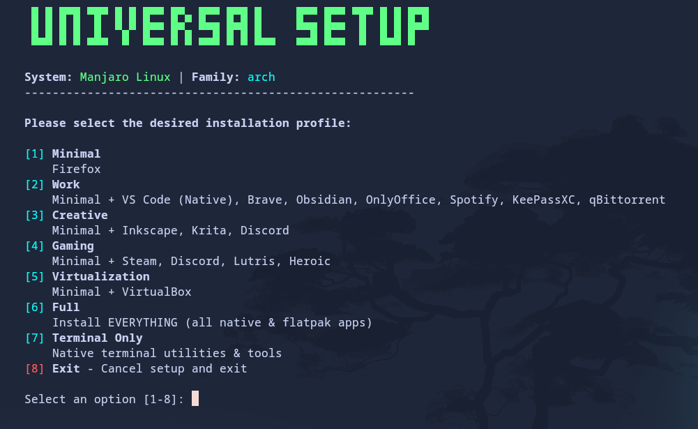

# Universal Linux Setup

Automated scripts for setting up a complete Linux desktop environment (Arch-based or Debian-based) with interactive profiles and module selection.

<p align="center">
  
</p>

## Supported Distributions

| Family | Distros |
|--------|---------|
| **Arch-based** | Arch Linux, Manjaro, CachyOS, EndeavourOS |
| **Debian-based** | Ubuntu, Linux Mint, Debian, Pop!\_OS |

> **Note:** The script auto-detects your specific distro and adapts its behavior accordingly — for example, it won't try to install `yay` on Manjaro (which already has `pamac`), and it won't add Ubuntu PPAs on Linux Mint.

## Features

- **Fully Automated:** Sets up a complete workstation from a minimal install.
- **Interactive TUI:** Easy-to-use menus to select your installation profile and which modules to run.
- **CLI Flags:** Power users can skip modules directly with `--skip-*` flags.
- **Cross-Distro:** Supports Arch and Debian/Ubuntu families with distro-specific adaptations.
- **Smart AUR Helper:** Auto-detects `paru`, `yay`, or `pamac` on Arch-based systems. Only installs `yay` on vanilla Arch if none is found.
- **Python Developer Ready:** Includes `pipx` for tools and a `pipi`/`pythoni` helper for a global dev venv.
- **Flatpak First:** Prioritizes Flatpak for most apps to keep the host system clean.
- **Idempotent:** Safe to re-run — won't reinstall or break existing configs.

## Prerequisites

1. A fresh installation of a supported distro (see table above).
2. The `git` package installed (`sudo pacman -S git` or `sudo apt install git`).
3. An active internet connection.

## Usage

### Standard Installation

```bash
git clone https://github.com/SamuelValleHdz/universal-linux-setup.git
cd universal-linux-setup
chmod +x install.sh
./install.sh
```

Follow the on-screen menus to:
1. Select your installation **profile** (Minimal, Work, Gaming, etc.).
2. Choose which **modules** to run (or skip any you don't need).

### Skip Modules via CLI Flags

Experienced users can bypass the interactive module selection:

```bash
# Skip terminal and tweaks modules
./install.sh --skip-terminal --skip-tweaks

# Skip everything except apps
./install.sh --skip-system --skip-terminal --skip-tweaks

# Show all available flags
./install.sh --help
```

| Flag | Skips |
|------|-------|
| `--skip-system` | Base system setup (repos, package manager, Flatpak) |
| `--skip-apps` | Application installation |
| `--skip-terminal` | Terminal & shell setup (Zsh, Oh My Zsh) |
| `--skip-tweaks` | Tweaks & dotfiles (Kitty theme, aliases) |

## Repository Structure

```
universal-linux-setup/
├── install.sh                      # Main orchestrator (TUI + module runner)
└── modules/
    ├── 01-system-setup.sh          # Repos, AUR helper, Flatpak setup
    ├── 02-install-apps.sh          # App installation by profile
    ├── 03-terminal-setup.sh        # Zsh, Oh My Zsh, plugins, PATH
    ├── 04-tweaks-and-config.sh     # Dotfiles, Kitty theme, shell aliases
    └── update-flatpak-aliases.sh   # Generates ~/.zshrc-flatpak-aliases
└── config/
    ├── kitty/                      # Kitty terminal config
    ├── fastfetch/                  # Fastfetch config + ASCII art
    └── xfce/                       # XFCE keyboard shortcuts and settings
```

## Installation Profiles

| Profile | Included Apps |
|---------|---------------|
| **Minimal** | Firefox |
| **Work** | Minimal + VS Code (Native), Antigravity IDE, Brave, Obsidian, OnlyOffice, Spotify, KeePassXC, qBittorrent |
| **Creative** | Minimal + Inkscape, Krita, Discord |
| **Gaming** | Minimal + Steam, Discord, Lutris, Heroic, Wine |
| **3D Printing** | Minimal + Bambu Studio, OrcaSlicer |
| **Virtualization** | Minimal + VirtualBox, QEMU, virt-manager |
| **Full** | Everything above |
| **Terminal Only** | btop, fastfetch, nsnake, and extras |
| **Custom** | Interactive category picker — choose exactly what you need |

## Aliases & Updates

The script automatically sets up an update alias:

- **Arch-based:** `syu` or `update` — updates system packages (via detected AUR helper), Flatpaks, and regenerates app aliases.
- **Debian-based:** `update` — runs `apt update && apt upgrade`, Flatpaks, and regenerates aliases.

App aliases are also auto-generated for all installed Flatpaks (e.g., type `obsidian` instead of `flatpak run md.obsidian.Obsidian`).

## Extras

Wallpaper: <https://wallhaven.cc/w/p9gr2p>
